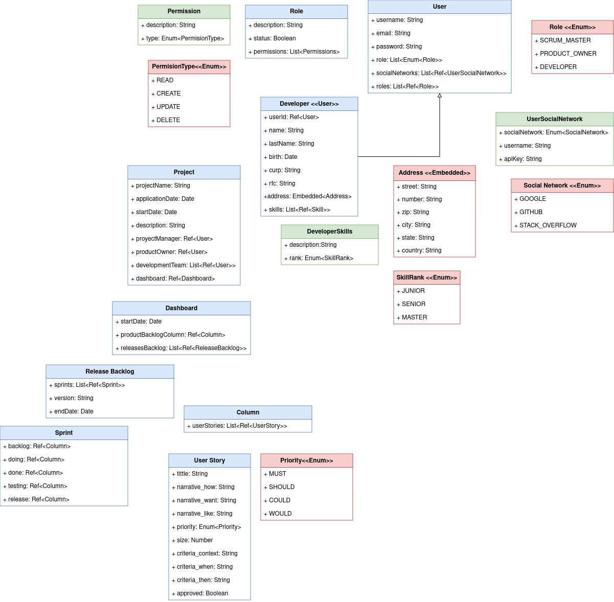

# Management Projects Software

## Description
This project is based on the implementation of a software project management using the Scrum methodology.  We build an api in node.js. The db is done in mongodb (comunicating with mongoose), the RACL is done with CASL, and the sessions are managed with JWT.

## Diagrams
### Class diagram
The models that we identified in the project are: 
- User
- Permission
- Role
- Developer
- Project
- Developer Skill
- User Social Network
- Dashboard
- Release Backlog
- Sprint 
- Column
- User Story 

After identifying the classes involved in the project, we make the next class diagram:


### Sequence diagram
The following Interaction Diagram explains the flow of the project according to the requirements. This diagram shows some of the interactions that will occur in the application like:
- Login 
- Create new project 
- Visualice project 
- Create new skill
- Create new user 
- Add new user story to Product Backlog Column
- Move a user story in a sprint from a column to another one

With these interactions identified, the following diagram was made:


###  Drive folder with both diagrams:
https://drive.google.com/drive/folders/1qG5St1E4TvYXubA3IJIctspczrTvgGXa?usp=sharing

## Requeriments
```
Javascript
Node.js
```

## Public credentials
These are the credentials for an admin account that you can use to test the aplication.
- **Email:** admin.
- **Password:** admin123

## Instructions to initialize the project
These where the commands executed to initialize the express aplication project:
```
npm install -g express-generator
express --view=pug project-manager
cd project-manager
npm install 
npm install @casl/ability bcrypt express-jwt jsonwebtoken mongoose
```
## Docker Image
To use this manual, download the image gary3k/manejador-proyectos.
```
docker pull gary3k/manejador-proyectos
docker run -ti manejador-proyectos

```
https://hub.docker.com/repository/docker/gary3k/manejador-proyectos/general


## Versioning
Version 1.0.0

## Authors
```
Adrian Alejandro Gonzalez Dominguez
Jair Delval Aguirre
Angel Eduardo Garibay Valenzuela
Brayan Ricardo Carrete Martinez
Jair Alejandro Gaytan Espindola
```
## Licence
This project is licensed under the MIT License - see the license.md file for details
